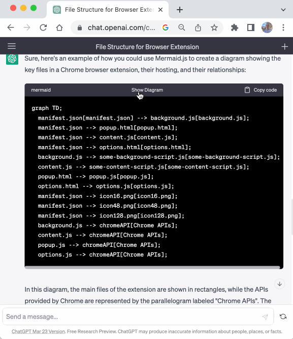
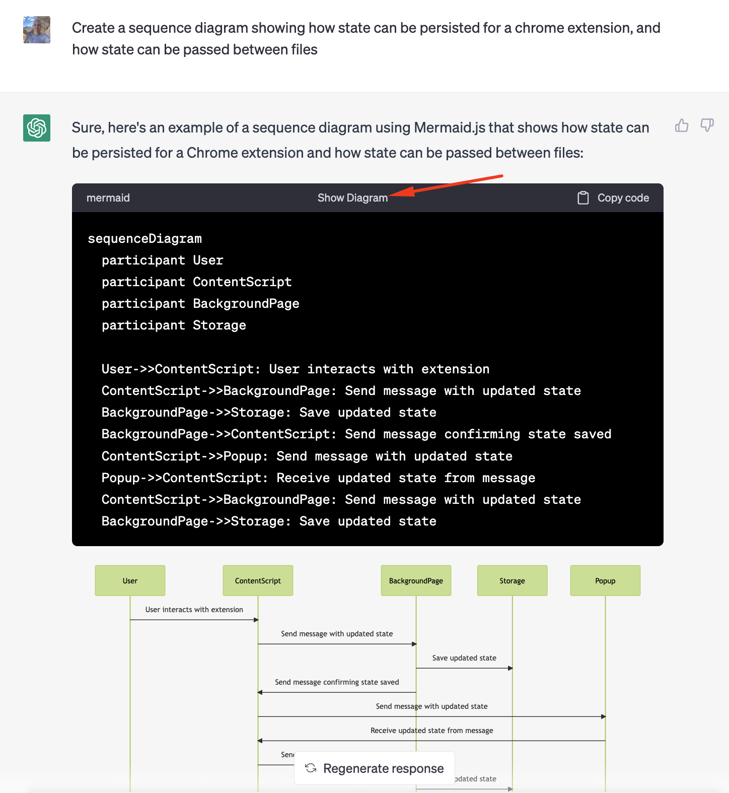

# puzlog

[](https://github.com/dwmkerr/puzlog/actions/workflows/main.yaml)
[](https://codecov.io/gh/dwmkerr/puzlog)

Work in progress. An extension to log online puzzle attempts.



Chrome Web Store: [Install TODO](https://chrome.google.com/webstore/detail/chatgpt-diagrams/gllophmfnbdpgfnbmbndlihdlcgohcpn)

<!-- vim-markdown-toc GFM -->

- [Quickstart](#quickstart)
- [Developer Guide](#developer-guide)
  - [Developer Commands](#developer-commands)
  - [Code Structure](#code-structure)
  - [Running the Sample Pages](#running-the-sample-pages)
  - [Manifest](#manifest)
  - [Generating Icons](#generating-icons)
  - [Formatting and Code Quality Rules](#formatting-and-code-quality-rules)
  - [Pre-Commit Hooks](#pre-commit-hooks)
  - [Testing](#testing)
  - [Debugging](#debugging)
  - [Reloading the Extension](#reloading-the-extension)
  - [Verifying Pull Requests](#verifying-pull-requests)
- [Versioning](#versioning)
- [Releasing](#releasing)
  - [Extension Screenshots](#extension-screenshots)
- [Task List](#task-list)

<!-- vim-markdown-toc -->

## Quickstart

Clone, install dependencies and build the extension:

```bash
git clone git@github.com:dwmkerr/puzlog.git
npm install
npm run build
```

Open [Chrome Extensions](chrome://extensions), choose 'Load Unpacked' and select the `./dist` folder. Open a puzzle, such as https://www.theguardian.com/crosswords/quiptic/1254.

Press the 'Puzlog' button in the toolbar, you will now have the option to record timings, track progress and so on.



## Developer Guide

[Node Version Manager](https://github.com/nvm-sh/nvm) is recommended to ensure that you are using the latest long-term support version of node.

Ensure you are using Node LTS, then install dependencies:

```bash
nvm use --lts
npm install
```

To run in local development mode, which will automatically reload when changes are made, use:

```bash
npm start
```

Load the unpacked extension in your browser from the `./dist` folder.

There is a CodePen with the popup which is useful for quickly playing with the formatting: https://codepen.io/dwmkerr/pen/gOqZRRW

### Developer Commands

The following commands can be used to help development:

| Command                    | Description                                                                     |
| -------------------------- | ------------------------------------------------------------------------------- |
| `npm start`                | Run in development mode. Updates `./dist` on changes to `./src`.                |
| `npm run build`            | Build the production bundle to `./dist`.                                        |
| `npm run tsc`              | Run the TypeScript compiler, verifies the correctness of the TypeScript code.   |
| -------------------------- | ------------------------------------------------------------------------------- |
| `npm test`                 | Run unit tests, output coverage to `./coverage`.                                |
| `npm run test:watch`       | Run unit tests, coverage only on files that test run on, watch mode.            |
| `npm run test:debug`       | Run unit tests, with the Chrome Inspector, initially 'break', watch mode.       |
| `npm run prettier`         | Check formatting of all files.                                                  |
| `npm run prettier:fix`     | Fix formatting of all files.                                                    |
| `npm run lint`             | Check linting of all files.                                                     |
| `npm run lint:fix`         | Fix linting issues in all files.                                                |
| -------------------------- | ------------------------------------------------------------------------------- |
| `make build`               | Create the release package.                                                     |
| `make test`                | Validate the code, running `tsc` and unit tests.                                |

### Code Structure

The code is structured in such a way that you should be able to immediately see the key files that make up the extension.

At root level are the essential files that make up an extension, all other code is kept in the [`./lib`](./lib) folder.

TODO

```
manifest.json  # the extension definition and metadata
content.ts     # the content script, runs on chatgpt browser tabs, renders the diagrams
options.html   # the UI for the options page
options.ts     # the logic for the options page
setup-jest.js  # utility to configure testing environment
lib/           # bulk of the logic for the extension
```

### Running the Sample Pages

The following command runs a local webserver, serving the content at [`./samples`](./samples). This makes it easy to test locally.

```bash
make serve-samples
```

The sample page is served at `http://localhost:3000`.

### Manifest

Note that the `version` field is omitted from [`manifest.json`](./src/manifest.json). The version in the manifest file is set to the current value in the [`package.json`](package.json) file as part of the build process.

### Generating Icons

You can use the `./scripts/generate-icons-from-128.sh` script to generate icons of all required sizes from 128 pixel icons:

```bash
./scripts/generate-icons-from-128.sh src/images/icon128.png
./scripts/generate-icons-from-128.sh src/images/icon128-started.png
./scripts/generate-icons-from-128.sh src/images/icon128-stopped.png
```

### Formatting and Code Quality Rules

[Prettier](https://prettier.io/) is used for formatting. Pre-commit hooks are used to enforce code style.

[ESLint](https://eslint.org/) is used for code-quality checks and rules.

To understand why both are used, check ["Prettier vs Linters"](https://prettier.io/docs/en/comparison.html).

### Pre-Commit Hooks

[Husky](https://github.com/typicode/husky) and [lint-staged](https://github.com/okonet/lint-staged) are used to run formatting and code quality checks on staged changes before they are committed.

The configuration for lint-staged is in the [`package.json`](./package.json) file.

### Testing

[Jest](https://jestjs.io/) is used as the testing framework. Crossword sample pages are loaded into the environment using [js-dom](https://github.com/jsdom/jsdom) and we then verify that the crossword code elements are identified and processed correctly.

Check the [Developer Commands](#developer-commands) section to see the various test commands that can be run. It is possible to watch tests, run tests in the debugger, and so on.

### Debugging

In development mode, open source maps by navigating to the "Sources > Content Scripts > puzlog" folder. These are inline source maps. You can also use "Command + P" and search for a file such as `content.ts`.

In production mode, source maps are generated as standalone files in the `./dist` folder.

### Reloading the Extension

There is no 'live reload' on file changes. The fastest way to reload is to run locally with `npm start`. Webpack will rebuild the extension on file changes. Then just press the "Refresh" button in the `chrome://extensions` page and reload the site you are debugging.

### Verifying Pull Requests

To verify that the code builds, the tests pass and the release package can be created run the commands below:

```bash
make build
make test
make release
```

These commands will be executed for pull requests.

## Versioning

The version of the extension is defined in the [`package.json`](./package.json) file.

Releasing in managed via [Release Please](https://github.com/googleapis/release-please) in the [`main.yaml`](./.github/workflows/main.yaml) workflow file.

If you need to manually trigger a release, run:

```bash
git commit --allow-empty -m "chore: release 2.0.0" -m "Release-As: 2.0.0"
```

## Releasing

When uploading a new version, follow the steps below.

### Extension Screenshots

If needed, update the screenshots. Screenshots should be 1280x800 pixels, set this in the Developer Tools (which can also be used to capture the screenshot to the Downloads folder.

Currently screenshots do not include a browser frame.

Open Developer Tools, use the 'device size' button to set the responsive screen size, adjust the size to 1280x800, delete the sidebar from the nodes view, press Command+Shift+P and select 'Capture Screenshot'.

Prompts for screenshots so far are:

TODO

1. Render a flowchart showing how a browser makes a web request and a server responds. Use mermaid.js.
2. Create a UML class diagram showing relationships for the data model for a simple food delivery database. Use mermaid.js.
3. Create an architecture diagram that would show the key components in an instant messaging application, use mermaidjs.
4. Create a sequence diagram showing how retry logic with retry queues is typically implemented when using Apache Kafka, use mermaidjs for the diagram

Resize screenshots with:

```bash
brew install imagemagick

new_width=1280
for input in ./docs/screenshots/*.png; do
    [[ -f "$input" ]] || continue
    output="${input/\.png/-${new_width}.png}"
    echo "Convert: ${input} -> ${output}"
    convert "${input}" -resize "${new_width}x" "${output}"
done
```

## Task List

A quick-and-dirty list of improvements and next steps:

Items with a `!` could be applied to the ChatGPT diagrams extension.

- [x] feat: rating component, rating in data model
- [x] feat: notes field
- [x] wip: fix styes in shadow root component
- [ ] wip: show timer increment
- [ ] wip: reopen puzzle page show state
- [ ] wip: puzzle id in puzlog page link
- [ ] feature: simple timer (from start time) in extension toolbar
- [ ] feat: move logic from content to background - note that we get a promise failure if we try and change values from the puzlog page - does it expect a content script running?
- [ ] refactor: no stopwatch for now - just total time, stopwatch can come later
      when adding stopwatch time this'll then be a separate storage key to avoid
      the timer blatting puzzle state.
- [x] bug: icons should always be visible in grid
- [ ] feat: simple on-page timer/start/stop
- [ ] bug: timer state seems to be lost when changing tabs
- [ ] feat: timer stop on change tab
- [ ] bug: doesn't work across multiple tabs
- [ ] feat: in progress icon for puzlog page
- [x] feat: finished status and icon
- [x] feat: cheated clues
- [x] bug: cannot sort or filter by 'title'
- [x] feat: sort by date started
- [x] bug(!): it seems all scripts are executed twice (loaded twice, even with `{ once: true }` in DOM Content Loaded
- [ ] check: see if a basic status indicator in the tab icon would be possible
- [ ] epic: finish xword
- [ ] epic: export json
- [ ] epic: save to cloud

- [ ] build(!): consider webpack dev server to serve sample page in local dev mode
- [ ] build(!): Create script to open a new chrome window, with the appropriate command line flags to load the dist unpacked

- [ ] refactor: create a 'puzzleId' based on a number rather than a URL - easier for links etc, however hold off on this as it might make sharing harder
- [ ] highlight selected

**Cleanup**

- [ ] style of icon, header of column should be separate or indented
- [ ] width of crossword title column

**Later**

- [ ] refactor: consider how to avoid race conditions e.g. the content.ts page
      triggers a chance but the puzlog page also changes the same element -
      maybe the main extension object needs to watch the puzzle local storage
      for changes and the UIs always just respond to that
- [ ] feat: popup shows the scraped puzzle data (setter, series, etc), which is
      stored in its own sub-object in the puzzle
- [ ] refactor: use react for popup page
- [ ] feat: cheated clues set on in-page overlay
- [ ] feat: better anagram helper
- [ ] feat(option): elapsed time vs clock time.
- [ ] feat(option): grey overlay on site when timer not started (to force timer)
- [ ] feat(!): cross browser support with web extension polyfill
- [ ] refactor: move bulk of logic into service worker
- [ ] bug: timer logic is a little odd, if you stop/pause at 00:01:01:999 for example, then pressing 'start' waits a full second before updating the tick. This is because of the logic being a bit weird, think we need to track the start/pause timestamp and make calculations based on that rather than 'last tick'
- [ ] feat: auto track progress based on jquery/expressions (e.g. selecting completed clues)
- [ ] feat: crossword series, setter, publish date, based on expressions, could be combined with the above
- [ ] feat: nullable fields should have an 'unset' style in the grid (e.g. grey) so users know to fill them in
